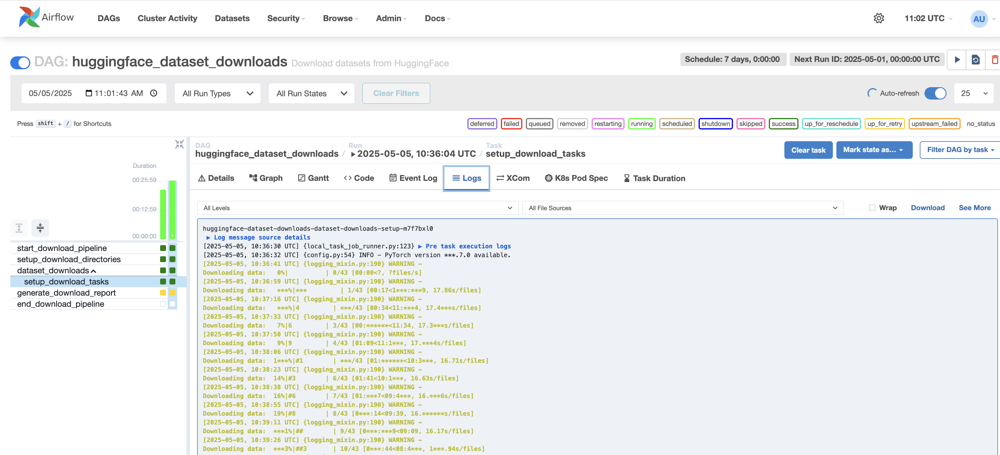

# Dataset Connector... An Initial Step for MLOps Porject



A robust framework for downloading, processing, and managing datasets with support for rate limiting, asynchronous downloads, and Apache Airflow integration.

Right Now, I have taken an example for HuggingFace

## 🚀 Overview

This project provides a scalable infrastructure for working with HuggingFace datasets in a production environment. It includes:

- A modular connector interface for dataset operations
- Built-in rate limiting and retry mechanisms
- Asynchronous download queuing
- Apache Airflow integration for scheduled workflows
- Kubernetes deployment configuration

## 📂 Project Structure

```
├── connectors/
│   ├── __init__.py
│   ├── base_connector_interface.py    # Abstract base class for all connectors
│   └── hf_dataset_connector.py        # HuggingFace dataset implementation
│
├── utils/
│   ├── rate_limiting_utils.py         # Token bucket and retry mechanisms
│   └── queue.py                       # Async request queue system
│
├── dags/
│   └── huggingface_dataset_downloads.py  # Airflow DAG for dataset downloads
│
├── operators/
│   └── huggingface_operators.py       # Custom Airflow operators
│
├── kubernetes/
│   ├── airflow-configmap.yaml         # Airflow configuration
│   ├── airflow-pvc.yaml               # Persistent volume claims
│   ├── airflow-secrets.yaml           # API keys and credentials
│   ├── airflow-values.yaml            # Helm chart values
│   └── postgres-values.yaml           # PostgreSQL config
│
└── hf_dataset_usage.py                # Example usage script
```

## 🔧 Installation

### Prerequisites

- Python 3.8+
- Apache Airflow 2.5+
- Kubernetes cluster (for production deployment)
- Docker/Podman (for container builds)
- Helm 3+ (for Kubernetes deployments)

### Local Development Setup

1. Create a virtual environment:
   ```bash
   python -m venv venv
   source venv/bin/activate  # On Windows: venv\Scripts\activate
   ```

2. Install dependencies:
   ```bash
   pip install -r requirements.txt
   ```

3. Configure your HuggingFace API key in your environment:
   ```bash
   export HUGGINGFACE_API_KEY=your_api_key_here
   ```

## 🔍 Core Components

### BaseConnector

The `BaseConnector` abstract class defines the standard interface for all data connectors in the MLOps pipeline. Implementing classes must provide methods for:

- Connecting to data sources
- Fetching data
- Transforming data to a standardized format
- Logging metadata about operations

### HuggingFaceDatasetConnector

This connector implements the `BaseConnector` interface specifically for HuggingFace datasets with features like:

- Connection pooling and session management
- Rate limiting at both global and instance levels
- Exponential backoff retry logic
- Asynchronous download queue with worker threads
- Metadata tracking and error handling

### TokenBucket Rate Limiter

The rate limiting system uses a token bucket algorithm to:

- Control request rates to external APIs
- Allow for configurable burst behavior
- Provide a clean interface for rate-limited functions

### Retry Mechanism

The retry decorator implements exponential backoff with:

- Configurable maximum retry attempts
- Exponential backoff with optional jitter
- Support for retrying specific exceptions or HTTP status codes

## 📊 Usage Examples

### Basic Usage

```python
from connectors.hf_dataset_connector import HuggingFaceDatasetConnector

# Configure the connector
config = {
    "api_key": "your_huggingface_api_key",
    "cache_dir": "./dataset_cache",
    "download_dir": "./downloaded_datasets",
    "rate_limit": {
        "tokens_per_second": 2,
        "max_tokens": 5
    },
    "retry": {
        "max_retries": 5,
        "base_delay": 1.0,
        "max_delay": 60
    },
    "use_queue": True,
    "queue_config": {
        "max_size": 100,
        "num_workers": 2
    }
}

# Initialize and connect
connector = HuggingFaceDatasetConnector(config)
connector.connect()

# Download a dataset asynchronously
result = connector.download_dataset(
    dataset_id="HuggingFaceTB/cosmopedia",
    subset="stories",
    split="train",
    wait=False  # Use the queue
)

# Wait for download to complete
print(f"Queued download, request ID: {result.get('request_id')}")
download_result = connector.queue.get_result(result.get('request_id'))
print(f"Download completed: {download_result.get('status')}")

# Close the connection
connector.close()
```

### Using with Airflow

This project includes a custom Airflow DAG and operators for scheduling dataset downloads:

1. Deploy the DAG file to your Airflow dags folder
2. Configure the necessary Airflow variables:
   - `HUGGINGFACE_API_KEY`: Your HuggingFace API key
   - `HUGGINGFACE_CACHE_DIR`: Directory to cache datasets
   - `HUGGINGFACE_DOWNLOAD_DIR`: Directory to save downloaded datasets
   - `HUGGINGFACE_DOWNLOAD_DATASETS`: JSON list of datasets to download

3. The DAG will handle scheduled downloads with proper rate limiting and error handling

## 🚢 Kubernetes Deployment

### Deployment Steps

1. Create the Airflow namespace:
   ```bash
   kubectl create namespace airflow
   ```

2. Apply configuration and secrets:
   ```bash
   kubectl apply -f kubernetes/airflow-configmap.yaml
   kubectl apply -f kubernetes/airflow-secrets.yaml
   ```

3. Make sure of docker images specification, here I have used local registry `localhost:5000`


4. Deploy PostgreSQL using Helm:
   ```bash
   helm install airflow-postgresql oci://registry-1.docker.io/bitnamicharts/postgresql \
     -n airflow -f kubernetes/postgres-values.yaml
   ```

5. Create persistent volume claims:
   ```bash
   kubectl apply -f kubernetes/airflow-pvc.yaml
   ```

6. Deploy Airflow using Helm:
   ```bash
   helm install airflow apache-airflow/airflow -n airflow -f kubernetes/airflow-values.yaml
   ```

### Uninstall

To remove the Airflow deployment:
```bash
helm uninstall airflow -n airflow
```

## 🔄 Current Development Status

The project currently provides:
- A functional connector for downloading datasets from HuggingFace
- Rate limiting and retry mechanisms
- Async download queue implementation
- Airflow DAG for scheduled downloads
- Kubernetes deployment configuration

### In-Progress Work

- Data sharing between Airflow DAGs for downstream ML pipelines
- Enhanced metadata tracking and reporting
- Integration with additional data sources
- Performance optimizations for large datasets

## 🛠️ Future Enhancements

Planned features include:
- Dataset versioning and cataloging
- Dataset validation and quality checks
- Integration with model training pipelines
- Enhanced monitoring and alerting
- Web UI for dataset browsing and management

## 📄 License

This project is licensed under [Your License] - see the LICENSE file for details.
